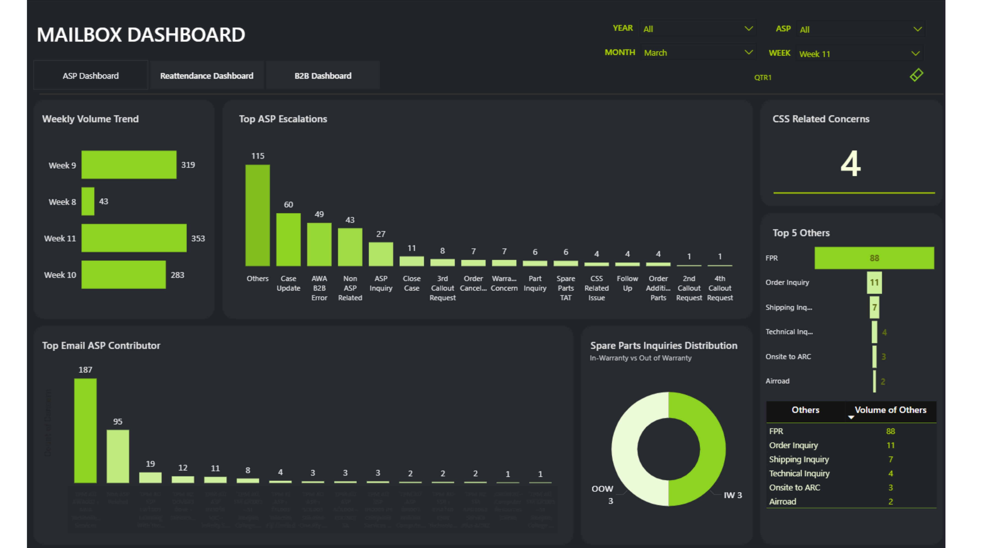
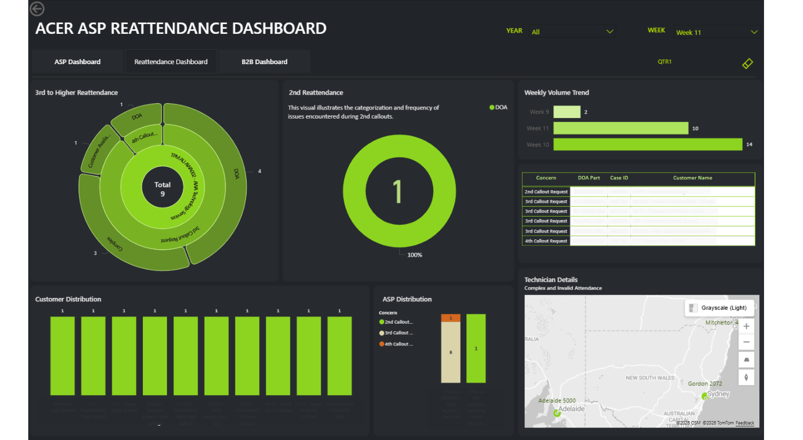

# PowerBI-Servicer-Dashboard
A Power BI dashboard built to monitor servicer performance and operational KPIs. This repository highlights report design, data modeling, and visualization techniques using confidential company data that has been visually anonymized for portfolio presentation.

## Report: Service Dashboard
- **Dataset:** Web-sourced data from SharePoint
- **Key Insights:** Weekly/Monthly email volume, categorized escalation types, system error breakdown
- **Techniques Used:** Interactive slicers, Sunburst chart, Decomposition Tree
- **Confidentiality Note:** Original report contains sensitive company data. Shared visuals have been blurred to preserve confidentiality.

## Dashboards

    
    

